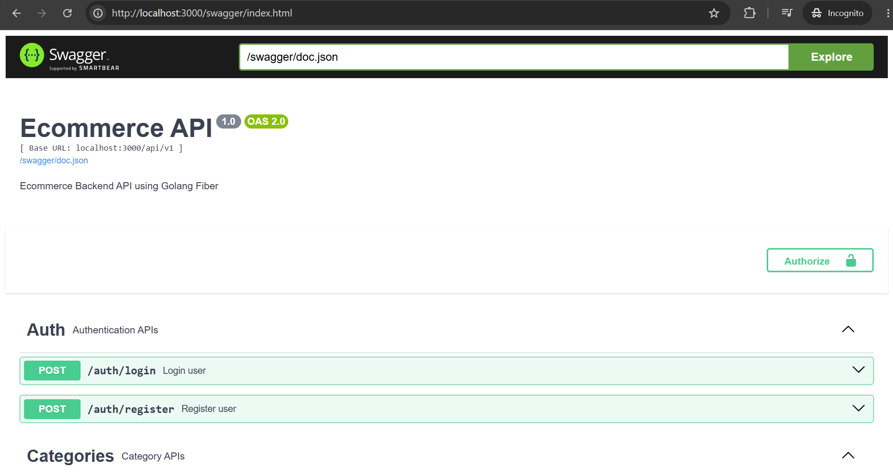

# 🛒 E-Commerce REST API

[](https://github.com/ardhisparahita/ecommerce-api/actions/workflows/ci.yml)


---

A RESTful E-Commerce API built with **Golang**, **Fiber**, **GORM**, and **MySQL** following the **Clean Architecture** pattern.

This project implements a complete backend system for an online shopping platform, including authentication, product management, shopping cart, checkout, order processing, payment management, and role-based authorization.

The project is intended for learning purposes and serves as a backend development portfolio demonstrating RESTful API development, software architecture, automated testing, and continuous integration.

---

## ✨ Highlights

- RESTful API
- Clean Architecture
- JWT Authentication
- Role-Based Authorization
- Product Image Upload
- Shopping Cart & Checkout
- Order & Payment Management
- Swagger Documentation
- Docker Support
- Database Migration
- Unit Testing (Service & Handler)
- GitHub Actions Continuous Integration

---

## 📑 Table of Contents

- [✨ Highlights](#-highlights)
- [🚀 Features](#-features)
- [🛠 Tech Stack](#-tech-stack)
- [🏗 Architecture](#-architecture)
- [📁 Project Structure](#-project-structure)
- [⚙ Prerequisites](#-prerequisites)
- [🚀 Installation](#-installation)
- [🔐 Environment Variables](#-environment-variables)
- [🗄 Database Migration](#-database-migration)
- [▶ Running the Application](#-running-the-application)
- [🐳 Running with Docker](#-running-with-docker)
- [📖 API Documentation](#-api-documentation)
- [🧪 Testing](#-testing)
- [⚙ Continuous Integration](#-continuous-integration)
- [🗂 Database Schema](#-database-schema)
- [📬 Postman Collection](#-postman-collection)
- [🛣 API Endpoints](#-api-endpoints)
- [🔑 Authentication](#-authentication)
- [🚀 Future Improvements](#-future-improvements)
- [📄 License](#-license)
- [👨‍💻 Author](#-author)

---

# 🚀 Features

The API provides a complete backend implementation for an e-commerce application with authentication, product management, shopping cart, checkout, and order processing.

## 👤 Authentication & Authorization

- ✅ User Registration
- ✅ User Login
- ✅ JWT Authentication
- ✅ User Profile
- ✅ Update Profile
- ✅ Change Password
- ✅ Role-Based Authorization (Admin & Customer)

---

## 📂 Category Management

- ✅ Create Category
- ✅ Get All Categories
- ✅ Get Category Detail
- ✅ Update Category

---

## 📦 Product Management

- ✅ Create Product
- ✅ Get All Products
- ✅ Product Pagination
- ✅ Product Search
- ✅ Filter Product by Category
- ✅ Get Product Detail
- ✅ Update Product
- ✅ Delete Product
- ✅ Upload Product Image

---

## 🏠 Address Management

- ✅ Create Address
- ✅ Get User Addresses
- ✅ Get Address Detail
- ✅ Update Address
- ✅ Delete Address

---

## 🛒 Shopping Cart

- ✅ Add Product to Cart
- ✅ Get Cart Items
- ✅ Update Cart Quantity
- ✅ Remove Cart Item
- ✅ Automatic Subtotal Calculation
- ✅ Automatic Grand Total Calculation

---

## 💳 Checkout

- ✅ Checkout Cart
- ✅ Create Order
- ✅ Create Payment Record
- ✅ Database Transaction Support

---

## 📋 Order Management

- ✅ Get User Orders
- ✅ Get Order Detail
- ✅ Cancel Order
- ✅ Mark Order as Paid
- ✅ Mark Order as Failed
- ✅ Mark Order as Shipped
- ✅ Mark Order as Completed

---

## 🛠 Developer Features

- ✅ Clean Architecture
- ✅ RESTful API
- ✅ Swagger Documentation
- ✅ Docker Support
- ✅ Database Migration (golang-migrate)
- ✅ GitHub Actions CI
- ✅ Unit Testing (Service Layer)
- ✅ Unit Testing (Handler Layer)

---

# 🛠 Tech Stack

The project is built using modern backend technologies with a focus on scalability, maintainability, and clean architecture.

| Category               | Technology                   |
| ---------------------- | ---------------------------- |
| **Language**           | Go 1.25                      |
| **Web Framework**      | Fiber v2                     |
| **ORM**                | GORM                         |
| **Database**           | MySQL 8                      |
| **Authentication**     | JWT (JSON Web Token)         |
| **Password Hashing**   | bcrypt                       |
| **Validation**         | go-playground/validator      |
| **API Documentation**  | Swagger (swaggo)             |
| **Database Migration** | golang-migrate               |
| **Containerization**   | Docker & Docker Compose      |
| **Testing**            | Go Testing Package + Testify |
| **CI/CD**              | GitHub Actions               |
| **Version Control**    | Git & GitHub                 |

---

## 📦 Main Dependencies

| Package                                  | Purpose            |
| ---------------------------------------- | ------------------ |
| `github.com/gofiber/fiber/v2`            | Web Framework      |
| `gorm.io/gorm`                           | ORM                |
| `gorm.io/driver/mysql`                   | MySQL Driver       |
| `github.com/golang-jwt/jwt/v5`           | JWT Authentication |
| `golang.org/x/crypto/bcrypt`             | Password Hashing   |
| `github.com/go-playground/validator/v10` | Request Validation |
| `github.com/stretchr/testify`            | Unit Testing       |
| `github.com/swaggo/fiber-swagger`        | Swagger UI         |
| `github.com/swaggo/swag`                 | Swagger Generator  |

---

## 🧩 Development Tools

- Visual Studio Code
- Postman
- Docker Desktop
- MySQL Workbench
- Git
- GitHub

---

# 🏗 Architecture

This project adopts the **Clean Architecture** pattern to ensure the codebase remains maintainable, scalable, and easy to test.

The application is divided into multiple layers, where each layer has a single responsibility and depends only on the layer below it through interfaces.

## Architecture Overview

```text
                    ┌──────────────────────────┐
                    │        HTTP Client       │
                    │ (Web / Mobile / Postman) │
                    └─────────────┬────────────┘
                                  │
                                  ▼
                    ┌──────────────────────────┐
                    │      Fiber Router        │
                    └─────────────┬────────────┘
                                  │
                                  ▼
                    ┌──────────────────────────┐
                    │       Middleware         │
                    │ JWT • Role • Logger      │
                    └─────────────┬────────────┘
                                  │
                                  ▼
                    ┌──────────────────────────┐
                    │        Handlers          │
                    │ HTTP Request / Response  │
                    └─────────────┬────────────┘
                                  │
                                  ▼
                    ┌──────────────────────────┐
                    │        Services          │
                    │ Business Logic           │
                    └─────────────┬────────────┘
                                  │
                                  ▼
                    ┌──────────────────────────┐
                    │      Repositories        │
                    │ Database Operations      │
                    └─────────────┬────────────┘
                                  │
                                  ▼
                    ┌──────────────────────────┐
                    │         MySQL            │
                    └──────────────────────────┘
```

---

## Layer Responsibilities

### 🌐 Handler Layer

Responsible for:

- Receiving HTTP requests
- Parsing request body and parameters
- Request validation
- Calling the appropriate service
- Returning standardized JSON responses

The handler **does not contain business logic**.

---

### ⚙ Service Layer

Responsible for:

- Implementing business rules
- Coordinating multiple repositories
- Executing database transactions
- Returning domain-specific errors

All business logic resides in this layer.

---

### 🗄 Repository Layer

Responsible for:

- Database CRUD operations
- Query execution using GORM
- Mapping between database tables and domain models

Repositories only communicate with the database and do not contain business rules.

---

### 🛢 Database Layer

The application uses **MySQL** as the primary relational database with **GORM** as the ORM.

Database schema changes are managed using **golang-migrate**.

---

## Request Flow

A typical request follows this flow:

```text
Client
   │
   ▼
Router
   │
Middleware
   │
Handler
   │
Service
   │
Repository
   │
MySQL
```

The response is returned in the reverse direction until it reaches the client.

---

## Advantages of Clean Architecture

- Separation of Concerns
- Easier Unit Testing
- Better Maintainability
- Scalable Project Structure
- Independent Business Logic
- Easier Dependency Injection
- Clear Layer Responsibilities
- Improved Code Readability

---

# 📁 Project Structure

The project follows the **Clean Architecture** pattern by separating presentation, business logic, data access, and infrastructure into different layers.

```text
ecommerce-api/
│
├── .github/                    # GitHub Actions workflows
│   └── workflows/
│       └── ci.yml
│
├── cmd/                        # Application entry point
│   └── main.go
│
├── docs/                       # Swagger documentation & images
│
├── internal/
│   ├── domain/                 # Entity models
│   ├── dto/                    # Request & Response DTOs
│   │   ├── request/
│   │   └── response/
│   ├── handler/                # HTTP handlers
│   ├── middleware/             # JWT & Role middleware
│   ├── repository/             # Database layer
│   ├── router/                 # Route registration
│   └── service/                # Business logic
│
├── migrations/                 # Database migration files
│
├── pkg/
│   ├── config/                 # Application configuration
│   ├── database/               # Database connection
│   ├── exception/              # Custom errors
│   └── utils/                  # Helper functions
│
├── postman/                    # Postman Collection & Environment
│
├── uploads/                    # Uploaded product images
│
├── Dockerfile
├── docker-compose.yml
├── go.mod
├── go.sum
└── README.md
```

---

## 📂 Folder Description

| Folder                | Description                                                     |
| --------------------- | --------------------------------------------------------------- |
| `.github/`            | GitHub Actions workflow for Continuous Integration              |
| `cmd/`                | Application entry point (`main.go`)                             |
| `docs/`               | Swagger documentation, ERD, and project images                  |
| `internal/domain`     | Domain entities representing database models                    |
| `internal/dto`        | Request and response objects exchanged through the API          |
| `internal/handler`    | HTTP handlers responsible for processing requests and responses |
| `internal/middleware` | Authentication and authorization middleware                     |
| `internal/repository` | Database access layer using GORM                                |
| `internal/router`     | API route registration                                          |
| `internal/service`    | Business logic layer                                            |
| `migrations/`         | SQL migration files managed by golang-migrate                   |
| `pkg/config`          | Environment configuration loader                                |
| `pkg/database`        | Database initialization and connection                          |
| `pkg/exception`       | Custom application errors                                       |
| `pkg/utils`           | Utility functions (JWT, validation, responses, helpers, etc.)   |
| `postman/`            | API testing collection and environment                          |
| `uploads/`            | Uploaded product images                                         |
| `Dockerfile`          | Docker image configuration                                      |
| `docker-compose.yml`  | Multi-container configuration for backend and MySQL             |

---

## 🧩 Layer Dependency

The dependency between layers follows the Clean Architecture principle.

```text
Handler
   │
   ▼
Service
   │
   ▼
Repository
   │
   ▼
Database
```

Each layer communicates only with the layer directly below it, making the project easier to maintain, test, and extend.

---

# ⚙ Prerequisites

Before running the project, make sure the following software is installed on your machine.

| Software       | Version       |
| -------------- | ------------- |
| Go             | 1.25 or later |
| MySQL          | 8.x           |
| Docker         | Latest        |
| Docker Compose | Latest        |
| golang-migrate | Latest        |
| Git            | Latest        |

---

# 🚀 Installation

Clone the repository.

```bash
git clone https://github.com/ardhisparahita/ecommerce-api.git
```

Navigate to the project directory.

```bash
cd ecommerce-api
```

Download all project dependencies.

```bash
go mod tidy
```

Verify dependencies.

```bash
go mod verify
```

---

# 🔐 Environment Variables

Create a `.env` file in the project root.

```text
APP_PORT=3000

DB_HOST=localhost
DB_PORT=3306
DB_NAME=ecommerce
DB_USER=root
DB_PASSWORD=password
DB_ROOT_PASS=password

JWT_SECRET=your_secret_key
```

### Environment Variable Description

| Variable       | Description                        |
| -------------- | ---------------------------------- |
| `APP_PORT`     | Backend application port           |
| `DB_HOST`      | MySQL server host                  |
| `DB_PORT`      | MySQL server port                  |
| `DB_NAME`      | Database name                      |
| `DB_USER`      | Database username                  |
| `DB_PASSWORD`  | Database password                  |
| `DB_ROOT_PASS` | MySQL root password (Docker)       |
| `JWT_SECRET`   | Secret key used to sign JWT tokens |

> **Important**
>
> Never commit your `.env` file to the repository. Add it to `.gitignore` to protect sensitive information.

---

# 🗄 Database Migration

This project uses **golang-migrate** to manage database schema changes.

## Start MySQL

Using Docker Compose:

```bash
docker compose up -d mysql
```

Verify that the MySQL container is running.

```bash
docker compose ps
```

---

## Run Database Migration

Apply all pending migrations.

```bash
migrate -path migrations -database "<DATABASE_URL>" up
```

Rollback the latest migration.

```bash
migrate -path migrations -database "<DATABASE_URL>" down 1
```

View current migration version.

```bash
migrate -path migrations -database "<DATABASE_URL>" version
```

---

# ▶ Running the Application

## Option 1 — Local Development

### 1. Start MySQL

```bash
docker compose up -d mysql
```

### 2. Apply Database Migration

```bash
migrate -path migrations -database "<DATABASE_URL>" up
```

### 3. Start the Backend

```bash
go run ./cmd
```

The application will be available at:

```
http://localhost:3000
```

Swagger documentation:

```
http://localhost:3000/swagger/index.html
```

---

## Verify the API

You can verify that the application is running by opening:

```
http://localhost:3000/swagger/index.html
```

Or by sending a request using Postman.

---

# 🐳 Running with Docker

The project also supports running the backend together with MySQL using Docker Compose.

---

## Build and Start All Containers

```bash
docker compose up --build
```

Run in detached mode.

```bash
docker compose up -d --build
```

---

## Start Backend Only

If the MySQL container is already running.

```bash
docker compose up backend
```

Detached mode.

```bash
docker compose up -d backend
```

---

## View Running Containers

```bash
docker compose ps
```

---

## View Backend Logs

```bash
docker compose logs -f backend
```

---

## View MySQL Logs

```bash
docker compose logs -f mysql
```

---

## Open MySQL Shell

```bash
docker exec -it mysql mysql -uroot -p
```

---

## Stop Backend

```bash
docker compose stop backend
```

---

## Stop MySQL

```bash
docker compose stop mysql
```

---

## Stop All Containers

```bash
docker compose down
```

---

## Remove Containers and Volumes

```bash
docker compose down -v
```

> **Note**
>
> Before running the backend for the first time, ensure that all database migrations have been successfully applied using **golang-migrate**.

---

# 📖 API Documentation

The API documentation is automatically generated using **Swagger (swaggo)**.

Once the application is running, open the following URL in your browser.

```
http://localhost:3000/swagger/index.html
```

Swagger provides:

- Interactive API documentation
- Request & Response examples
- Authentication support using JWT Bearer Token
- Endpoint descriptions
- Request validation schema

### Swagger Preview



---

# 🌐 API Endpoints

The API is organized into several resource groups.

| Module         | Description                                            |
| -------------- | ------------------------------------------------------ |
| Authentication | User registration, login, profile, password management |
| Categories     | Product category management                            |
| Products       | Product CRUD, search, pagination, image upload         |
| Addresses      | Customer address management                            |
| Carts          | Shopping cart management                               |
| Checkout       | Checkout process                                       |
| Orders         | Order & payment management                             |

---

## Authentication

| Method | Endpoint                       | Description              |
| ------ | ------------------------------ | ------------------------ |
| POST   | `/api/v1/auth/register`        | Register new user        |
| POST   | `/api/v1/auth/login`           | User login               |
| GET    | `/api/v1/auth/profile`         | Get current user profile |
| PUT    | `/api/v1/auth/profile`         | Update profile           |
| PATCH  | `/api/v1/auth/change-password` | Change password          |

---

## Categories

| Method | Endpoint                  |
| ------ | ------------------------- |
| POST   | `/api/v1/categories`      |
| GET    | `/api/v1/categories`      |
| GET    | `/api/v1/categories/{id}` |
| PUT    | `/api/v1/categories/{id}` |

---

## Products

| Method | Endpoint                             |
| ------ | ------------------------------------ |
| POST   | `/api/v1/products`                   |
| GET    | `/api/v1/products`                   |
| GET    | `/api/v1/products/{id}`              |
| PUT    | `/api/v1/products/{id}`              |
| DELETE | `/api/v1/products/{id}`              |
| PATCH  | `/api/v1/products/{id}/upload-image` |

---

## Addresses

| Method | Endpoint                 |
| ------ | ------------------------ |
| POST   | `/api/v1/addresses`      |
| GET    | `/api/v1/addresses`      |
| GET    | `/api/v1/addresses/{id}` |
| PUT    | `/api/v1/addresses/{id}` |
| DELETE | `/api/v1/addresses/{id}` |

---

## Shopping Cart

| Method | Endpoint             |
| ------ | -------------------- |
| POST   | `/api/v1/carts`      |
| GET    | `/api/v1/carts`      |
| PUT    | `/api/v1/carts/{id}` |
| DELETE | `/api/v1/carts/{id}` |

---

## Checkout

| Method | Endpoint            |
| ------ | ------------------- |
| POST   | `/api/v1/checkouts` |

---

## Orders

| Method | Endpoint                       |
| ------ | ------------------------------ |
| GET    | `/api/v1/orders`               |
| GET    | `/api/v1/orders/{id}`          |
| PATCH  | `/api/v1/orders/{id}/cancel`   |
| PATCH  | `/api/v1/orders/{id}/pay`      |
| PATCH  | `/api/v1/orders/{id}/fail`     |
| PATCH  | `/api/v1/orders/{id}/ship`     |
| PATCH  | `/api/v1/orders/{id}/complete` |

---

# 🔑 Authentication

Most endpoints require authentication using **JWT Bearer Token**.

Example:

```http
Authorization: Bearer <your_access_token>
```

Login first using:

```http
POST /api/v1/auth/login
```

Example request:

```json
{
  "email": "admin@example.com",
  "password": "password123"
}
```

Successful response:

```json
{
  "code": 200,
  "status": "success",
  "message": "login success",
  "data": {
    "access_token": "<JWT_TOKEN>"
  }
}
```

> **Note**
>
> Public endpoints such as **Register** and **Login** do not require authentication. All other protected endpoints require a valid JWT access token.

---

# 🧪 Testing

This project includes automated unit testing to ensure business logic and HTTP handlers behave as expected.

The testing strategy focuses on:

- Service Layer
- Handler Layer
- Mocking Dependencies
- HTTP Request & Response Validation

---

## Unit Test

Run all unit tests.

```bash
go test ./...
```

Run all unit tests with verbose output.

```bash
go test ./... -v
```

Run unit tests with race detector.

```bash
go test ./... -race
```

Generate code coverage.

```bash
go test ./... -coverprofile=coverage.out
```

Display coverage summary.

```bash
go tool cover -func=coverage.out
```

Open HTML coverage report.

```bash
go tool cover -html=coverage.out
```

---

## Tested Components

### ✅ Service Layer

The following services are covered by unit tests.

| Service          | Status |
| ---------------- | ------ |
| Auth Service     | ✅     |
| Category Service | ✅     |
| Product Service  | ✅     |
| Address Service  | ✅     |
| Cart Service     | ✅     |
| Checkout Service | ✅     |
| Order Service    | ✅     |

---

### ✅ Handler Layer

The following HTTP handlers are covered by unit tests.

| Handler          | Status |
| ---------------- | ------ |
| Auth Handler     | ✅     |
| Category Handler | ✅     |
| Product Handler  | ✅     |
| Address Handler  | ✅     |
| Cart Handler     | ✅     |
| Checkout Handler | ✅     |
| Order Handler    | ✅     |

---

## Mocking

Unit tests use mocked dependencies to isolate business logic from external components.

Mocked components include:

- Service Interfaces
- Repository Interfaces
- Fiber HTTP Context
- Database Operations

This allows tests to run quickly without requiring a running MySQL instance.

---

# ⚙ Continuous Integration

The project uses **GitHub Actions** to automatically validate every push and pull request.

Workflow file:

```text
.github/workflows/ci.yml
```

The CI pipeline performs the following steps automatically:

- Checkout Repository
- Setup Go Environment
- Cache Go Modules
- Download Dependencies
- Verify Dependencies
- Run Go Vet
- Execute Unit Tests
- Generate Code Coverage
- Build Application

Workflow status:

[](https://github.com/ardhisparahita/ecommerce-api/actions/workflows/ci.yml)

---

## Benefits

The testing and CI pipeline ensures:

- ✅ Business logic behaves correctly
- ✅ API handlers return expected responses
- ✅ Build failures are detected automatically
- ✅ Static analysis is performed before merging
- ✅ New changes do not break existing functionality

---

# 🗂 Database Schema

The database schema is designed following relational database principles and supports the complete e-commerce workflow.

Main entities include:

- Users
- Categories
- Products
- Addresses
- Carts
- Orders
- Order Items
- Payments

Entity Relationship Diagram (ERD):


> **Note**
>
> The database schema is automatically maintained through **golang-migrate**, ensuring every schema change is version-controlled and reproducible.

---

# 📬 Postman Collection

To simplify API testing, this project provides a ready-to-use Postman Collection.

Location:

```text
postman/
├── Ecommerce API.postman_collection.json
└── Ecommerce Local.postman_environment.json
```

### Import into Postman

1. Open Postman.
2. Click **Import**.
3. Select:

```text
Ecommerce API.postman_collection.json
```

4. Import the environment:

```text
Ecommerce Local.postman_environment.json
```

5. Select the environment and start testing the API.

---

## Included Requests

The collection contains requests for:

- Authentication
- Categories
- Products
- Addresses
- Shopping Cart
- Checkout
- Orders
- Payment Management

---

# 🚀 Future Improvements

Several features can still be added to improve the project.

### Authentication

- Refresh Token
- Email Verification
- Forgot Password
- Social Login (Google OAuth)

---

### Product

- Product Rating
- Product Review
- Wishlist
- Product Recommendation

---

### Shopping

- Discount & Coupon
- Shipping Cost Integration
- Inventory Reservation
- Order Tracking

---

### Payment

- Midtrans Integration
- Xendit Integration
- Payment Webhook
- Automatic Payment Confirmation

---

### Performance

- Redis Cache
- Pagination Optimization
- Background Job Queue
- Image Compression

---

### DevOps

- Kubernetes Deployment
- Nginx Reverse Proxy
- Prometheus Monitoring
- Grafana Dashboard

---

### Testing

- Repository Integration Test
- End-to-End Testing
- API Load Testing
- Benchmark Testing

---

## Roadmap

| Feature               | Status       |
| --------------------- | ------------ |
| REST API              | ✅ Completed |
| Clean Architecture    | ✅ Completed |
| Swagger Documentation | ✅ Completed |
| Docker Support        | ✅ Completed |
| Unit Testing          | ✅ Completed |
| GitHub Actions CI     | ✅ Completed |
| Redis Cache           | ⏳ Planned   |
| Payment Gateway       | ⏳ Planned   |
| Email Verification    | ⏳ Planned   |
| Kubernetes Deployment | ⏳ Planned   |

---

# 📄 License

This project was developed for educational purposes and serves as a backend development portfolio.

You are welcome to explore, learn from, and modify the source code for personal or educational use.

If you use this project as a reference, proper attribution is greatly appreciated.

---

# 🙏 Acknowledgements

This project was built using several amazing open-source technologies.

Special thanks to the maintainers of:

- Go
- Fiber
- GORM
- MySQL
- Swagger (swaggo)
- Docker
- Testify
- GitHub Actions

Their contributions make modern backend development significantly easier.

---

# 👨‍💻 Author

## Ardhis Parahita

Backend Developer specializing in **Golang**, **Fiber**, **RESTful API Development**, and **Clean Architecture**.

### 📫 Contact

- **GitHub**  
  https://github.com/ardhisparahita

- **LinkedIn**  
  https://www.linkedin.com/in/ardhisparahita

- **Email**  
  ardhisparahita@gmail.com

---

## ⭐ Support

If you find this project useful:

- ⭐ Star this repository
- 🍴 Fork the project
- 🐞 Report issues
- 💡 Suggest improvements

Contributions, feedback, and discussions are always welcome.

---

<div align="center">

### 🚀 Happy Coding!

Made with ❤️ using **Go**, **Fiber**, and **Clean Architecture**

</div>

